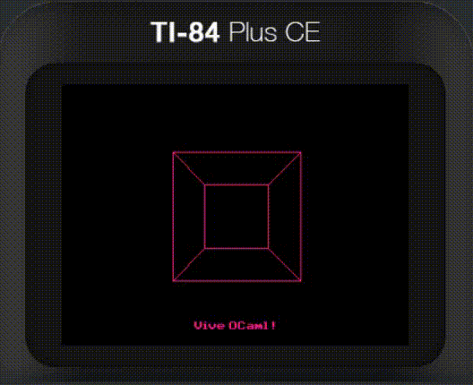

# C_of_ocaml 🐪🤓

Compiles an OCaml program to a standalone ANSI C file. Here's a spinny cube program running on a calculator. Its OCaml source is [here](calc/cube).



## Features
- ✅ Garbage collector
- ✅ Random selections of the stdlib
- ❌ Floats
- ❌ Exceptions
- ❌ Objects

## Usage

Use opam to create a switch and install the deps for this repo:

```
opam switch create c_of_ocaml 5.2.0
opam pin add js_of_ocaml-compiler 5.8.2
opam install core_unix ppx_jane core async expect_test_helpers_async
```

Make sure to use the `c_of_ocaml` switch when building this project, since it keeps the `Js_of_ocaml` dependency at the right revision.

To build an OCaml program for pc:
1. `git clone https://github.com/nathanfarlow/c-of-ocaml`
2. `cd c-of-ocaml`
3. `dune build example`
4. `cat _build/default/example/main.c`

To build for ti 84 ce:
1. Set up the [ti 84 ce toolchain](https://ce-programming.github.io/toolchain/)
2. `git clone https://github.com/nathanfarlow/c-of-ocaml`
3. `cd c-of-ocaml`
4. `dune build calc/hello_world`
5. Copy `_build/default/calc/hello_world/CAMLHI.8xp` to calculator

If you're interested, you can see an example generated C file [here](assets/example_generated.c).
