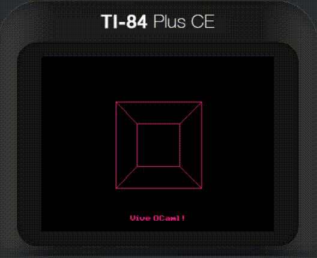

# C_of_ocaml 🐪🤓

Compiles an OCaml program to a standalone ANSI C file. Here's a spinny cube program running on a calculator. Its OCaml source is [here](calc/cube).

## Features
- ✅ Garbage collector
- ✅ Random selections of the stdlib
- ❌ Floats
- ❌ Exceptions
- ❌ Objects

## Usage

First install OCaml through opam. Then use opam to install the deps for this repo.

To build an OCaml program for pc:
1. `git clone https://github.com/nathanfarlow/c-of-ocaml`
2. `cd c-of-ocaml`
3. `dune build example`
4. `cat _build/default/example/main.c`

To build for ti 84 ce:
1. Set up the [ti 84 ce toolchain](https://ce-programming.github.io/toolchain/)
2. `git clone https://github.com/nathanfarlow/c-of-ocaml`
3. `cd c-of-ocaml`
4. `dune build calc/hello_world`
5. Copy `_build/default/calc/hello_world/CAMLHI.8xp` to calculator
